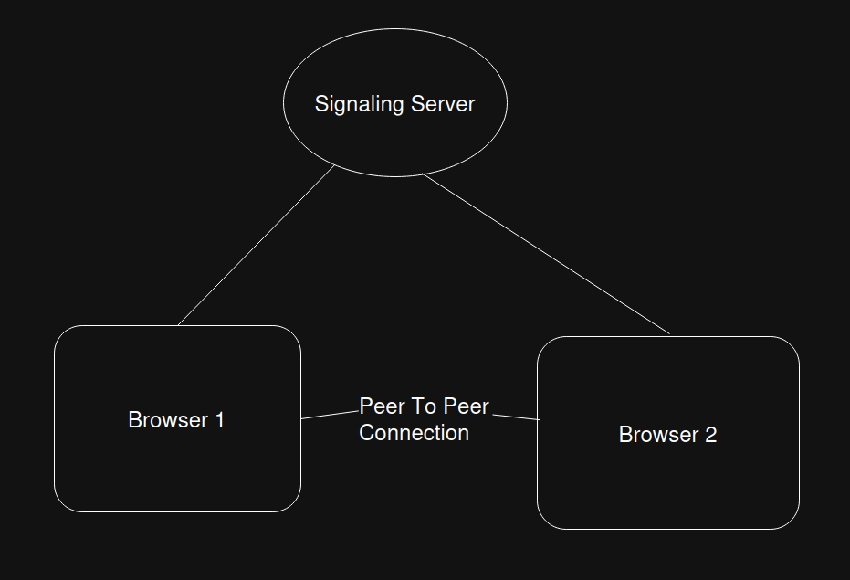

# WebRTC Video Streaming Application

A real-time peer-to-peer video streaming application built with WebRTC, React, TypeScript, and WebSocket.

## 🚀 Features

- **Real-time Video Streaming**: Direct peer-to-peer video communication using WebRTC
- **Signaling Server**: signaling server made with websocket for WebRTC connection establishment
                        (to create-offer , answer and adding ice-candidates).
- **Sender/Receiver Architecture**: Separate components for streaming and receiving video

## 🏗️ Architecture



<!-- ```
┌─────────────────┐    WebSocket     ┌─────────────────┐
│   Sender Web    │◄────────────────►│ Signaling Server │
│    Browser      │                  │   (WebSocket)   │
└─────────────────┘                  └─────────────────┘
         │                                    ▲
         │                                    │
         │           WebRTC P2P               │
         │        (Direct Connection)         │
         ▼                                    │
┌─────────────────┐    WebSocket     ─────────┘
│  Receiver Web   │◄────────────────┘
│    Browser      │
└─────────────────┘
``` -->

## 🛠️ Technologies Used

### Backend
- **Node.js** with TypeScript
- **WebSocket (ws)** using it as a signaling server
- **WebRTC** to make peer to peer connection and streaming

### Frontend
- **React** with TypeScript
- **React Router** for navigation
- **WebRTC APIs** for peer connection
- **MediaDevices API** for camera access

## 🚀 Getting Started

### 1. Clone the repository
```bash
git clone https://github.com/10-abhi/webrtc
cd webrtc
```

### 2. Install Backend Dependencies
```bash
cd backend
npm install
```

### 3. Install Frontend Dependencies
```bash
cd ../frontend
npm install
```

### 4. Start the Backend Server
```bash
cd ../backend
npm run dev

```
The signaling server will start on `ws://localhost:8080`

### 5. Start the Frontend Development Server
```bash
cd ../frontend
npm run dev
```
The frontend will be available at `http://localhost:5173`


### Testing the Connection:
1. Open two browser tabs/windows
2. Go to `/sender` in one tab and `/receiver` in another
3. Click "Start Video" on the sender tab
4. The video should appear in the receiver tab

